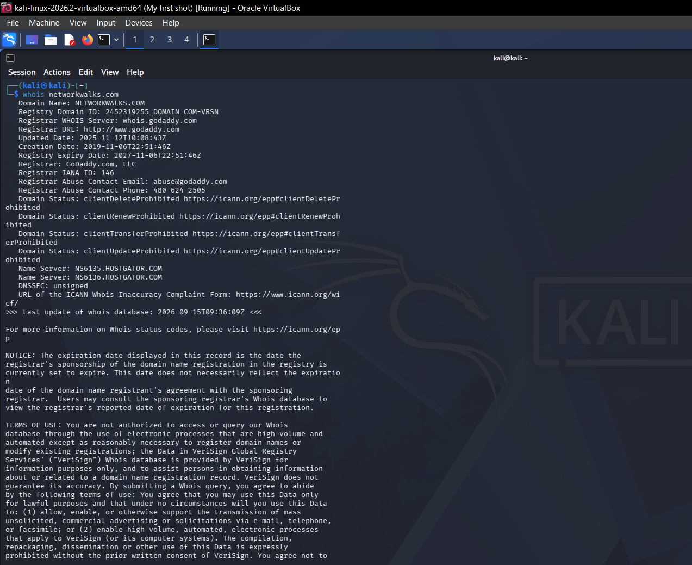
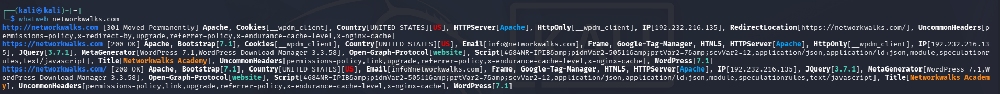
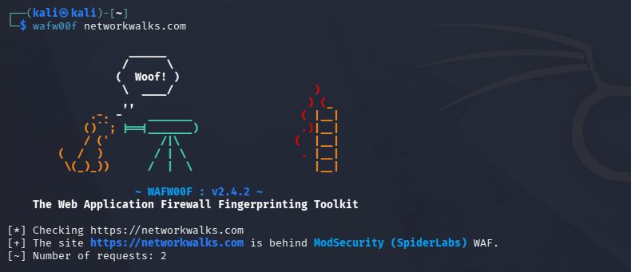
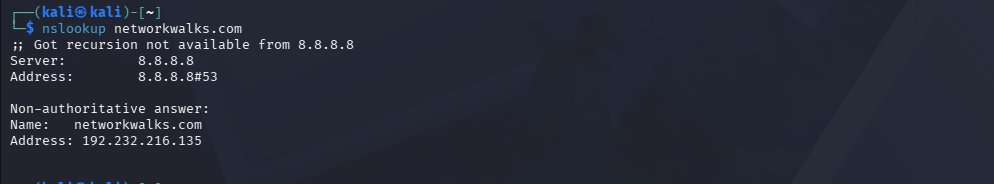
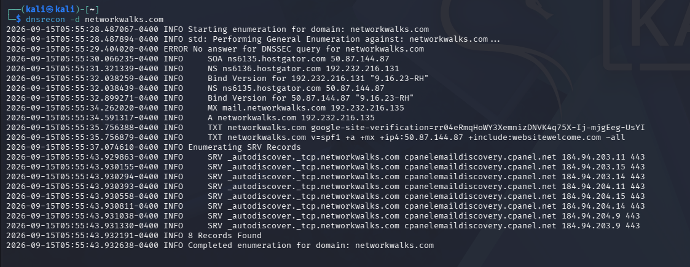
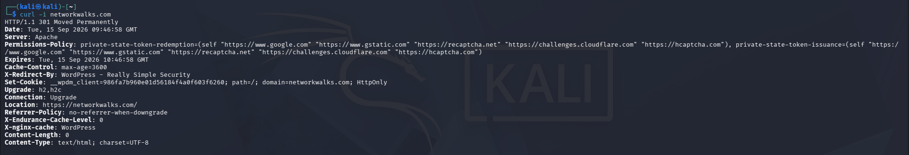
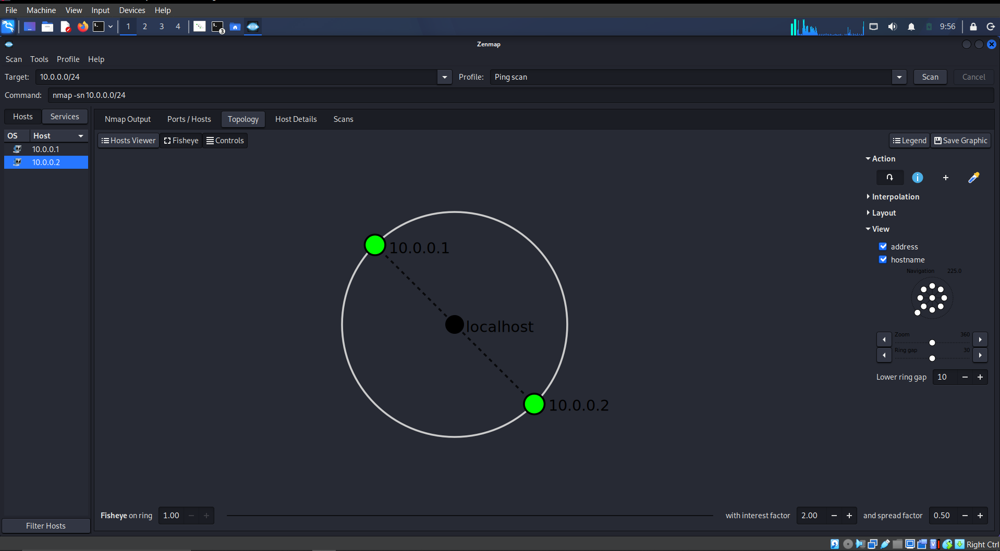
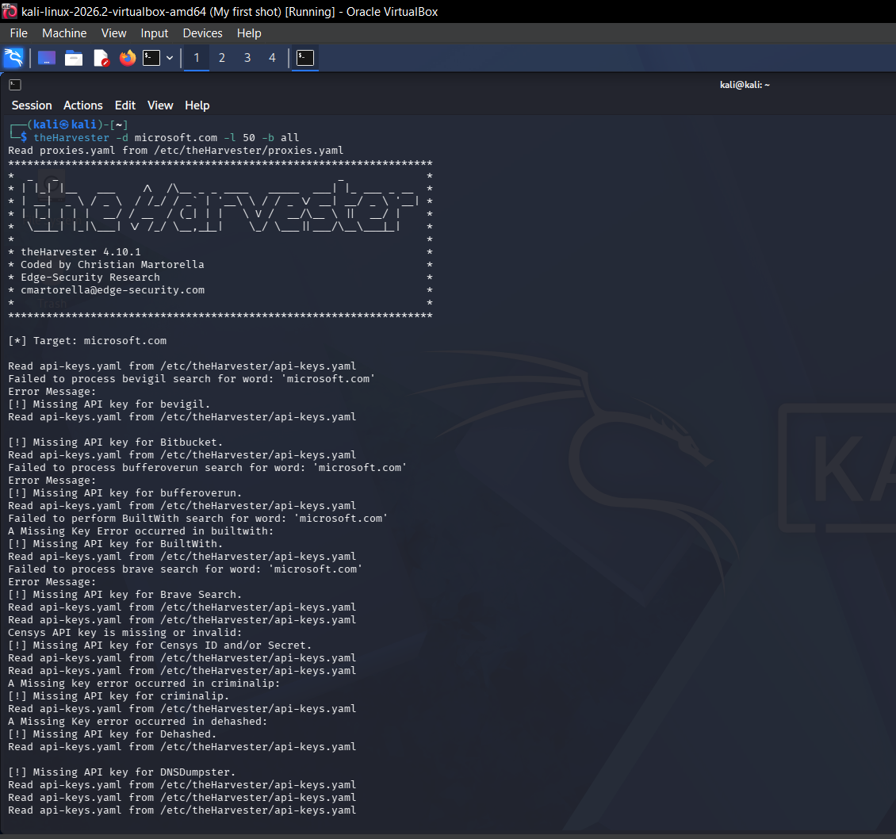

# Penetration Testing Report — Footprinting & Network Scanning (Week 2)

**Program:** Networkwalks Academy — Cybersecurity Internship, Batch B082
**Pentester:** Shomari Ismail
**Date:** 17 August 2026
**Modules completed:** W2-PM1 (Multiple Kali Tools), W2-PM4 (Footprinting with theHarvester), W2-PM5 (Zenmap Scanning)

## Scope

| | |
|---|---|
| **Client/Target** | 1. networkwalks.com <br> 2. Local LAN network (own) |
| **Permission** | Yes — written permission for third-party target; owner permission for own devices |
| **Phases covered** | Phase 1: Reconnaissance & Footprinting <br> Phase 2: Scanning & Network Discovery |

## Liability Disclaimer

All activities in this report were performed only against systems/devices for which written permission was secured, or devices owned by the pentester. Materials are for education and research purposes only.

## Introduction

This report covers footprinting the `networkwalks.com` domain using six Kali Linux tools:

- whois
- whatweb
- curl -i
- wafw00f
- nslookup
- dnsrecon

It also covers scanning a local network with Zenmap (W2-PM5) and using theHarvester to perform email/subdomain enumeration against a target organization.

One module covers the footprinting phase and the other covers the scanning phase, so together they show how an attacker moves from gathering public information to mapping live hosts on a network. This is the Week 2 deliverable of the ongoing Networkwalks internship program.

All footprinting commands were run in Kali Linux; Zenmap (also run on Kali Linux) was used for scanning.

Every activity below includes the exact command used, the result observed, and a short note on why the finding matters from an attacker's point of view.

## Tools Used

| Tool | Purpose |
|---|---|
| Kali Linux | Operating system used for reconnaissance activities |
| WHOIS | Find domain registration details (owner, dates, name servers) |
| whatweb | Fingerprint web technologies (server, CMS, plugins, IP) |
| nslookup | Resolve the domain name to its IP address using DNS |
| curl -I | Read the HTTP response headers of the website |
| wafw00f | Detect whether a Web Application Firewall protects the site |
| dnsrecon | Enumerate all DNS records (NS, MX, SPF, TXT, SRV) |
| Zenmap (Nmap GUI) | Scan the local subnet to find live hosts, IPs, and MAC addresses |
| ifconfig | Local IP and MAC address identification |
| theHarvester | Gather the list of email IDs related to a target organization |

## Footprinting & Reconnaissance

Target: `networkwalks.com`

Reconnaissance was performed using six Kali Linux tools: WHOIS, WhatWeb, Nslookup, Curl, Wafw00f, and DNSRecon. Each tool collected a different type of information about the target.

###WHOIS

Find domain registration details (owner, dates, name servers).

$ whois networkwalks.com
```console
(kali㉿kali)-[~]
└─$ whois networkwalks.com
Domain Name: NETWORKWALKS.COM
Registry Domain ID: 2452319255_DOMAIN_COM-VRSN
Registrar WHOIS Server: whois.godaddy.com
Registrar URL: [http://www.godaddy.com](http://www.godaddy.com)
Updated Date: 2025-11-12T10:08:43Z
Creation Date: 2019-11-06T22:51:46Z
Registry Expiry Date: 2027-11-06T22:51:46Z
Registrar: GoDaddy.com, LLC
Registrar IANA ID: 146
Registrar Abuse Contact Email: abuse@godaddy.com
Registrar Abuse Contact Phone: 480-624-2505
Domain Status: clientDeleteProhibited [https://icann.org/epp#clientDeleteProhibited](https://icann.org/epp#clientDeleteProhibited)
Domain Status: clientRenewProhibited [https://icann.org/epp#clientRenewProhibited](https://icann.org/epp#clientRenewProhibited)
Domain Status: clientTransferProhibited [https://icann.org/epp#clientTransferProhibited](https://icann.org/epp#clientTransferProhibited)
Domain Status: clientUpdateProhibited [https://icann.org/epp#clientUpdateProhibited](https://icann.org/epp#clientUpdateProhibited)
Name Server: NS6135.HOSTGATOR.COM
Name Server: NS6136.HOSTGATOR.COM
DNSSEC: unsigned
```

**Result:** Confirms hosting provider (HostGator) and registrar (GoDaddy).

### WhatWeb

Used to identify technologies used by the website.

$ whatweb networkwalks.com

http://networkwalks.com [301 Moved Permanently] Apache, Cookies[__wpdm_client], Country[UNITED STATES][US],
HTTPServer[Apache], HttpOnly[__wpdm_client], IP[192.232.216.135], RedirectLocation[https://networkwalks.com/],
UncommonHeaders[permissions-policy,x-redirect-by,upgrade,referrer-policy,x-endurance-cache-level,x-nginx-cache]

https://networkwalks.com [200 OK] Apache, Bootstrap[7.1], Cookies[__wpdm_client], Country[UNITED STATES][US],
Email[info@networkwalks.com], Frame, Google-Tag-Manager, HTML5, HTTPServer[Apache], HttpOnly[__wpdm_client],
IP[192.232.216.135], JQuery[3.7.1], MetaGenerator[WordPress 7.1,WordPress Download Manager 3.3.58],
Open-Graph-Protocol[website], Title[Networkwalks Academy], WordPress[7.1]


**Result:** WordPress 7.1, WordPress Download Manager 3.3.58, jQuery 3.7.1, Bootstrap 7.1, Apache — exact version disclosure.

### Nslookup

Used to resolve the domain name to its IP address.

$ nslookup networkwalks.com

Server: 8.8.8.8
Address: 8.8.8.8#53

Non-authoritative answer:
Name: networkwalks.com
Address: 192.232.216.135


### Curl (-I)

Used to inspect the HTTP response headers. This exposed the WordPress REST API endpoint (`/wp-json/`) and the name of the active security plugin.

$ curl -i networkwalks.com
---text
HTTP/1.1 301 Moved Permanently
Date: Tue, 15 Sep 2026 09:46:58 GMT
Server: Apache
Permissions-Policy: private-state-token-redemption=(self "https://www.google.com" "https://www.gstatic.com"
"https://recaptcha.net" "https://challenges.cloudflare.com" "https://hcaptcha.com"), private-state-token-issuance=(self ...)
Expires: Tue, 15 Sep 2026 10:46:58 GMT
Cache-Control: max-age=3600
X-Redirect-By: WordPress - Really Simple Security
Set-Cookie: __wpdm_client=986fa7b960e01d56184f4a0f603f6260; path=/; domain=networkwalks.com; HttpOnly
Upgrade: h2,h2c
Connection: Upgrade
Location: https://networkwalks.com/
Referrer-Policy: no-referrer-when-downgrade
X-Endurance-Cache-Level: 0
X-nginx-cache: WordPress
Content-Length: 0
Content-Type: text/html; charset=UTF-8

### Wafw00f

Used to determine whether a Web Application Firewall was protecting the website.

$ wafw00f networkwalks.com
---text
[*] Checking https://networkwalks.com
[+] The site https://networkwalks.com is behind ModSecurity (SpiderLabs) WAF.
[~] Number of requests: 2


**Result:** ModSecurity (SpiderLabs) WAF confirmed present — a defensive finding.

### DNSRecon

Used to enumerate DNS records.

**Result:** Provided information relating to name servers, mail servers, SPF/TXT records, service records, and DNS software information.

## Network Scanning with Zenmap

Target: local LAN (own network)

For this activity, Zenmap was used to perform network discovery on a local network. The task required identifying the local IP address and subnet, discovering live hosts, identifying their IP and MAC addresses, and generating a network topology.

### Steps

1. Ran `ifconfig` to identify the local IP address and LAN subnet.
2. Entered the subnet into Zenmap and ran a **Ping Scan** to identify active hosts.
3. Opened the **Topology** section in Zenmap, enabled the legend, and saved the network topology in PDF format.

### Results

Two live hosts were identified:

- `10.0.0.1`
- `10.0.0.2`

A single MAC address was also returned as part of the results.

**Why it matters:** On a production network, live-host and MAC-address discovery via a simple ping scan is the first step toward lateral movement. On a personal/lab LAN, this is primarily a demonstration of the technique.

## Email & Subdomain Harvesting with theHarvester

For this activity, theHarvester was used to gather emails and subdomains related to a target organization.

### Steps

1. Ran theHarvester against `networkwalks.com` using the Baidu source, with the result limit set to 1000:

theHarvester -d networkwalks.com -l 1000 -b baidu

2. Ran theHarvester using all available sources, with the result limit set to 50.

### Results

**Mails found: 3**

- `dotnet-docker-bot@microsoft.com`
- `opencode@microsoft.com`
- `secure@microsoft.com`

**Why it matters:** Real, harvestable email addresses are the most direct enabler of targeted phishing and social engineering — typically the highest real-world-impact finding in a footprinting exercise, since it targets people rather than just infrastructure.

## Risk Analysis, Impact & Recommendations

### Risk Analysis Summary

| Finding | Risk Level | Why It Matters |
|---|---|---|
| WHOIS registration data exposed (registrar, dates, name servers) | Low | Public by design (ICANN requirement), but confirms hosting provider (HostGator) and registrar (GoDaddy), narrowing an attacker's next targets |
| WhatWeb fingerprinting revealed WordPress 7.1, WordPress Download Manager 3.3.58, jQuery 3.7.1, Bootstrap 7.1, Apache | Medium | Exact version disclosure lets an attacker search for known CVEs matching those specific versions instead of guessing blindly |
| HTTP headers exposed via curl (Server: Apache, WordPress REST endpoint, security plugin name "Really Simple Security") | Medium | Confirms server software and reveals the exact security plugin in use, letting an attacker research known bypasses for that specific plugin |
| WAF detected (ModSecurity/SpiderLabs) via wafw00f | Low (Positive control) | A defensive finding — confirms a real protective layer exists, though detectability also lets an attacker research known bypass techniques |
| DNS records enumerated via dnsrecon (NS, MX, SPF, TXT, SRV) | Low–Medium | Reveals mail server infrastructure and SPF configuration, informing email spoofing feasibility and revealing additional subdomains/services |
| Local LAN scan (Zenmap) revealed 2 live hosts and a MAC address | Medium (local context only) | On a production network, this is the first step toward lateral movement; on a personal/lab LAN, mainly a demonstration of the technique |
| theHarvester email enumeration returned 3 email addresses | Medium–High | Real, harvestable email addresses are the most direct enabler of targeted phishing and social engineering |

### Overall Impact

Individually, none of these findings represent a direct compromise — everything gathered here is passive, publicly available reconnaissance rather than an exploited vulnerability. In combination, however, they give an attacker a meaningful head start: confirmed software versions reduce the effort needed to identify a viable exploit, confirmed email addresses provide direct phishing targets, and confirmed WAF presence lets an attacker choose bypass techniques in advance rather than discovering the WAF mid-attack. This reflects the real purpose of the footprinting phase: it doesn't breach anything on its own, but it meaningfully shortens the path to a later, more damaging phase (exploitation).

### Recommendations

- **Suppress or generalize version disclosure** — configure WordPress, jQuery, Bootstrap, and Apache to hide or obscure exact version numbers in headers and page source.
- **Review and minimize exposed HTTP headers** — headers like `X-Redirect-By` that name the exact security plugin in use should be suppressed where possible.
- **Enforce SPF/DKIM/DMARC properly** — confirm these are fully and correctly configured to reduce email spoofing risk tied to the harvested addresses.
- **Reduce publicly harvestable email addresses** — use role-based contact forms instead of direct email addresses, and train staff whose addresses are exposed on phishing awareness.
- **Maintain and regularly test the existing WAF configuration** — keep it updated and periodically test it against current bypass techniques.
- **Segment and monitor the local LAN** — for any network beyond a personal lab, use VLAN segmentation and monitor for unauthorized scanning activity.
- **Adopt a periodic footprinting review** — periodically run the same reconnaissance tools against the organization to understand what a real attacker could learn at any given time.

### Evidence collected







.PNG)



